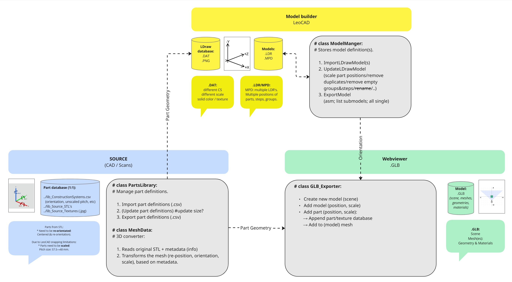

# LDraw Editor

3 components:
1. Create LDraw/LeoCAD library, from source files (Stl/Png/Jpeg)
2. Ldraw model editor (remove duplicates, import/export submodels etc)
3. LDraw → GLB converter, using Trimesh.

_________________________________________________
## Main LDraw database:
Basicall a part list (csv), including file locations & metadata.

### Source files:
.csv; STL; picture files.

### class parts_db:
Collection of parts, consisting:
- Data:
  - STL file. (binairy) (1:1) [mm]
  - Texture file. (optional)
- Metadata: 
  - Part type.
  - Part Orientation: front, side, top
  - Orign of part: center, top, bottom, ..
  - RotationXaxis.
  - Pitch distance.
- LDraw export information:
  - LDraw description. (so categories could be used)
  - LDraw category.
  - LDraw scale.
  - LDraw color.
- FileVersion.

→ Import database (.csv)
→ Export database (.csv)
→ ExportLDrawFiles(destination_path)

### class MeshData:
Reads STL files and able to export to:
- LDraw, including optional planar textures.

→ Read STL file
→ Write STL file
→ Orientate STL file (metadata)
→ Scale STL file
→ ExportMeshToLDraw(metadata)
_________________________________________________
## LDraw Model Manager:
Loads/saves LeoCAD LDR/MPD files.

### cls ModelManager:
- Dict. of (sub)models:
  - Dict ID: model name
  - Per submodel: list of parts, like LDraw definition.
→ Import (LDR/MPD) (remove doubles, remove empty groups, ...)
→ Update (filenames, positions) (needs LibraryManager)
→ Export (LDR/MPD)
→ ExportSubModelsToLDR
→ ExportFlattenedSubModel

_________________________________________________
## GLB Exporter:
Needs:
- Trimesh & numpy.
- Path to LDraw parts libary.
- LDConfig.ldr.

### cls LDRtoGLBConverter:
→ Converter includes:
  - convert_ldr_to_scene(model.ldr)
  - add_three_point_lighting
